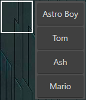

# Where's Waldo?


---

## Description

This is a "Where's Waldo?" web application that models the gameplay of the homonymous children's puzzle, where the player is tasked with visually locating characters within a richly detailed image.

The app is composed of a React/TypeScript front-end that communicates with a Ruby on Rails back-end designed as a JSON API with RESTful routing and persists data using a PostgreSQL database.

### **Note:**

This repository contains code for only the front-end part of the app. The repository for the back-end is at [wheres-waldo-api](https://github.com/royojeda/wheres-waldo-api).

_Other tools used in the front-end include Create-React-App, Tailwind CSS, ESLint, and Prettier._

---

## Table of Contents

- [Installation](#installation)
- [Usage](#usage)
- [Features](#features)
- [Reflections](#reflections)

---

## Installation

There are a couple of ways to run the application:

1. The easier way is to visit the [online live preview](https://waldo.fly.dev/).

2. The other option is to clone the repository to your computer by running the following command in the command line (you must have **Git** and **Node.js** installed):

   ```bash
   git clone git@github.com:royojeda/wheres-waldo.git
   ```

   and then run:

   ```bash
   cd wheres-waldo
   ```

   to enter the project directory, run

   ```
   npm install
   ```

   to install the project dependencies, and finally, run:

   ```
   npm start
   ```

   to start the local development server.

---

## Usage

At the start of each game, the player is assigned a set of four characters randomly-selected from a pool saved in the database to locate.

<p align="center">
  
</p>

The player then starts the game and is expected to make guesses by clicking on different parts of the main image to bring up a targeting box and selecting the name of the character that they've found.

<p align="center">
  
</p>

The game ends when the player has successfully tagged all four assigned characters, at which point the time it took them to complete said task is displayed as their score. The player is prompted for a name to represent this score in the list of the game's high scores to see how they did versus other playthroughs.

<p align="center">
  
</p>

---

## Features

- **Responsive targeting box size**. The size of the targeting box scales linearly with the size of the main image. This ensures that the difficulty of tagging a character will not vary across different screen resolutions. As it is inherently more difficult to visually identify characters on smaller screens, the player can zoom in on the image, and the size of the targeting box will adjust accordingly.

- **Business logic is delegated to the back-end**. The algorithm for validating the correctness of a player's answer is moved to the back-end. This makes it, at the very least, difficult for the player to cheat by searching the client-facing JavaScript code for the correct locations of the characters. Similarly, the logic for computing the player's score is also written on the back-end to avoid malicious modification.

- **Intuitive user interface**. The images of the assigned characters are always visible to the player in case they forget or are not familiar with their appearances. Appropriate responses for both correct and incorrect guesses are shown to the player. Minimal user action is needed to play; there are no unnecessary clicks or elements.

- **Scoped high scores**. Seeing as there are many different assignable characters but only four are given for each game, the high score list shown at the game's end should only contain scores from games that had the same set of characters. Now the player can't complain that their score only got beaten because other characters are easier to find!

---

## Reflections

This was the first time I interfaced a React-based front-end with a Ruby on Rails backend. Using a library or framework with Rails that is different from its default, Hotwire, does require more work. It is beneficial, however, to have the ability to accomplish this, given the rapid changes in the ecosystem of JavaScript front-end frameworks. At the same time, a different server-side language and framework can also be substituted in.

The main challenges in the front-end were implementing the logic to locate and record the location of a user's click action on an image and making it so that the actual size of the image doesn't affect this recorded location. This is an important task in the goal of allowing the game to be playable on different device sizes. Additionally, sending HTTP requests to the back-end API in the context of this game was a novel experience.
